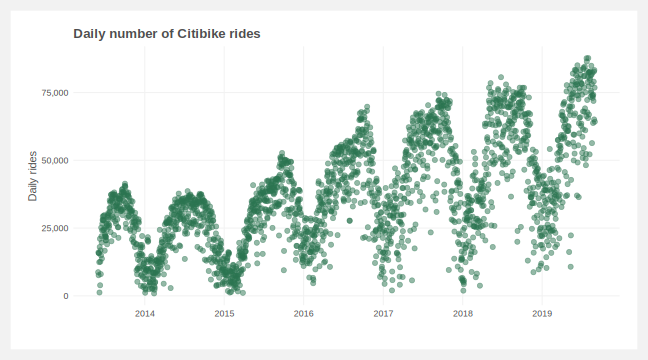
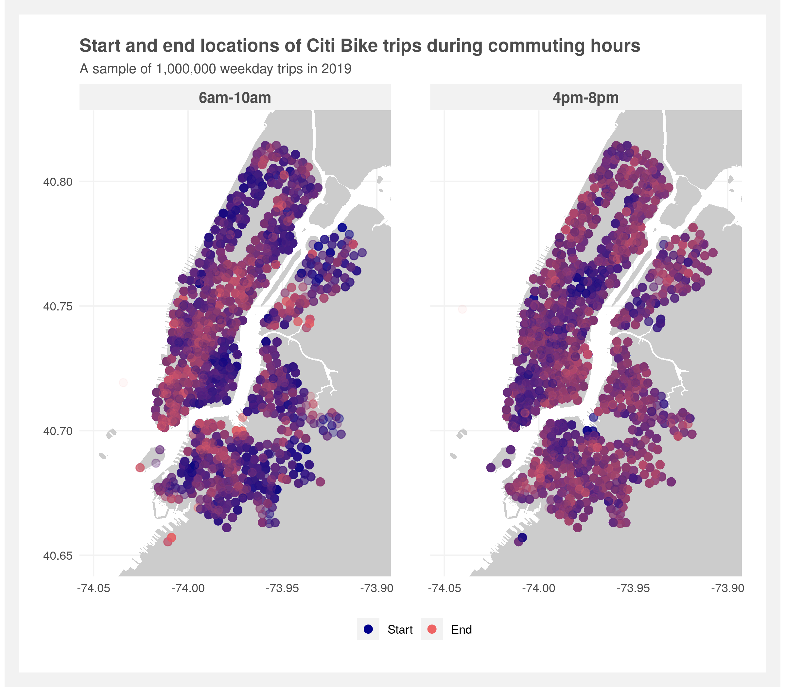
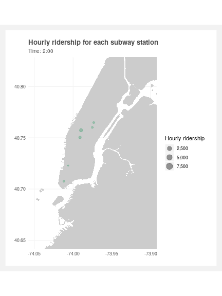
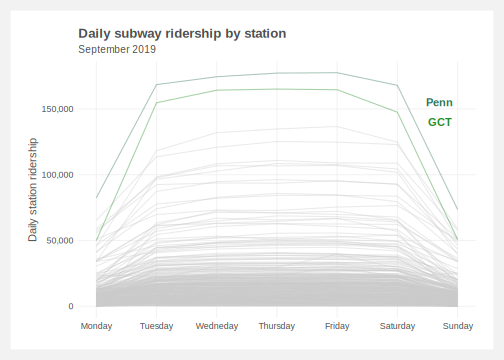

# NYC-data

The goal of this project is to pull together a database of the various NYC transportation options to ease and expedite future analyses. Currently, the database includes Citi Bike and subway data, and is approximately 20gb representing 140mm rows.

`Create_database.R` creates the SQLite database of the Citi Bike, subway, and (eventually) taxi trip data. Shell scripts in each folder must be run first to download the data. Individual files to clean and analyze the data from the database are in the folders: [Citi-bike](Citi-bike), [Subway-turnstiles](Subway-turnstiles), [Taxi](Taxi).

Once the database is created, data can easily be accessed via SQL and [dbplyr](https://dbplyr.tidyverse.org/) queries:
```
# establish the connection to the database
conn <- dbConnect(RSQLite::SQLite(), "NYC.db")

# query and mutate on-disk
turnstile.df <- tbl(conn, "turnstile.2019")
turnstile.df %>%
  select(Station, Time, Entries, Exits) %>%
  group_by(Station) %>%
  summarize(Entries = sum(Entries),
            Exits = sum(Exits))

# or pull data into memory and then treat as a standard data frame
turnstile.df <- tbl(conn, "turnstile.2019") %>% collect() 
```

## To-do list
- [x] Build database core
- [x] Add in Citi Bike data to database
- [x] Add in Subway data to database
- [ ] Add in taxi data to database
- [x] Add lat/long information for each subway station
- [ ] Ensure date time formats are consistent across tables
- [x] Create example of modeling on-disk
- [x] Create example visualizations
- [ ] Add Central Park weather to database

## Visualizations created from the database

<p align="center">

</p>

<p align="center">

</p>

<p align="center">

</p>

<p align="center">

</p>

<p align="center">

</p>

